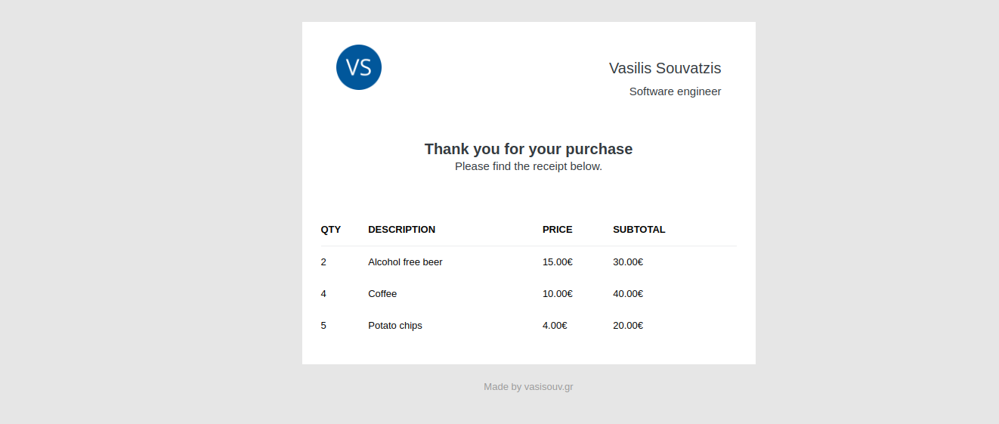
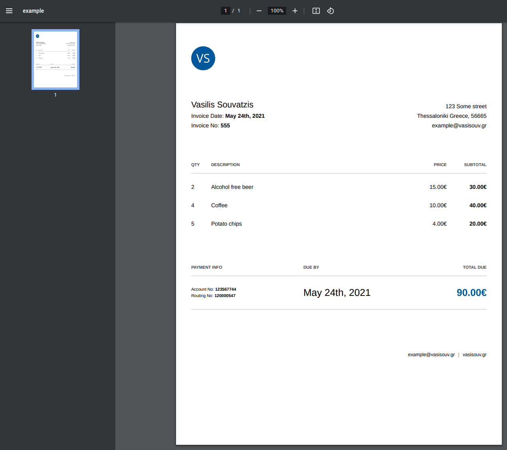

# Painter 🎨

A Typescript Node.js REST API service for rendering emails and pdfs.

Features:
* **[Express](https://expressjs.com/)** - app web framework
* **[Eta](https://eta.js.org/)** - template composition
* **[mjml](https://mjml.io/)** - responsive email framework
* **[playwright](https://playwright.dev/)** - html to pdf rendering


## How It Works

Painter is a REST API with dynamic endpoints, representing filesystem template files, with
each path pointing to specific template file. There are two base api paths:

### Emails

Base path:`/api/paint/email/:templatePath`

Emails use the mjml framework and markup language to ensure mail client compatibility.

Example:

```
curl --request POST \
  --url http://localhost:3003/api/paint/email/example \
  --header 'Content-Type: application/json' \
  --data '{
  "items": [
    {
      "description": "Alcohol free beer",
      "price": "15.00",
      "quantity": 2
    },
    {
      "description": "Coffee",
      "price": "10.00",
      "quantity": 4
    },
    {
      "description": "Potato chips",
      "price": "4.00",
      "quantity": 5
    }
  ]
}
'
```

The service responds with the email's HTML, ready to be sent.
```
<!doctype html>
<html xmlns="http://www.w3.org/1999/xhtml" xmlns:v="urn:schemas-microsoft-com:vml" xmlns:o="urn:schemas-microsoft-com:office:office">
  <head>
    <title>

    </title>
    <!--[if !mso]><!-->
    <meta http-equiv="X-UA-Compatible" content="IE=edge">
    <!--<![endif]-->
    <meta http-equiv="Content-Type" content="text/html; charset=UTF-8">
    <meta name="viewport" content="width=device-width, initial-scale=1">
    <style type="text/css">
      #outlook a { padding:0; }
      body { margin:0;padding:0;-webkit-text-size-adjust:100%;-ms-text-size-adjust:100%; }
      table, td { border-collapse:collapse;mso-table-lspace:0pt;mso-table-rspace:0pt; }
      img { border:0;height:auto;line-height:100%; outline:none;text-decoration:none;-ms-interpolation-mode:bicubic; }
      p { display:block;margin:13px 0; }
    </style>
    ....
```



### Pdfs

Base path:`/api/paint/pdf/:templatePath`

Pdfs are rendered from HTML using Playwright.

Example:

```
curl --request POST \
  --url http://localhost:3003/api/paint/pdf/example \
  --header 'Content-Type: application/json' \
  --data '{
  "items": [
    {
      "description": "Alcohol free beer",
      "price": "15.00",
      "quantity": 2
    },
    {
      "description": "Coffee",
      "price": "10.00",
      "quantity": 4
    },
    {
      "description": "Potato chips",
      "price": "4.00",
      "quantity": 5
    }
  ]
}
'
```

The service responds with the pdf Buffer Blob.


